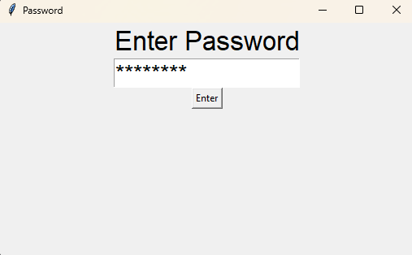
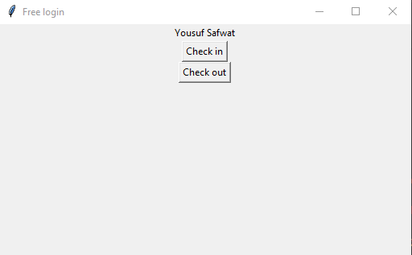
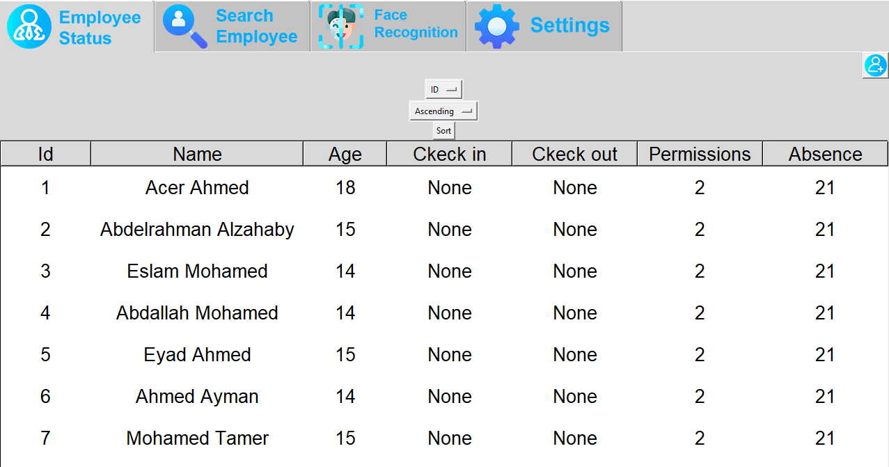
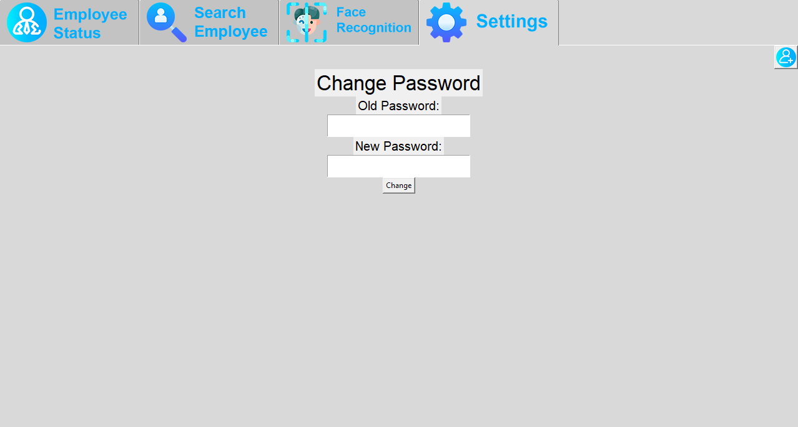

# **WorkSync – AI-Powered Attendance & Employee Management System**

WorkSync is an intelligent Employee Attendance and Management System that combines **AI**, **Machine Learning**, and **Face Recognition** to streamline how organizations track employee presence and manage personnel data.
With a clean GUI, integrated MySQL database, and multiple secure login methods, WorkSync provides a seamless experience for both employees and administrators.

---

# **📘 Overview**

WorkSync is built to improve attendance accuracy and employee data management using AI-driven face recognition. It ensures security by restricting the full dashboard to administrators, while still providing quick and easy attendance access for regular employees.

---

# **✨ Features**

* 🔐 **Three login methods**:

  * Admin password login
  * AI face recognition login
  * “Free Login” mode for non-admin employees to check in/out without accessing admin features

* 👨‍💼 **Admin-only dashboard** with:

  * Employee database table
  * Sorting, searching, and editing tools
  * AI-powered face recognition attendance
  * Settings panel to modify login credentials

* 🧠 **Face recognition check-in/out system**

* 🗄️ **MySQL database** storing all employee data and attendance logs

* 🎨 **Modern GUI with clean icons and intuitive layout**

---

# **🚀 System Workflow**

First you get the **Login Options**.

---

## **1️⃣ Application Launch Screen**

When the program starts, WorkSync presents the user with **three login choices**:

### **• Password Login (Admin Only)**

Admins can enter their password to access the full system dashboard.

---

### **• Face Recognition Login**

Admins can log in using the face recognition AI model for enhanced security.

---

### **• Free Login (Employee Attendance Only)**

For regular employees—allows simple check-in/check-out **without accessing any admin screens**.

---

# **🔐 Login Methods**

| Login Type                 | Access Level | Description                                            |
| -------------------------- | ------------ | ------------------------------------------------------ |
| **Password Login**         | Admin        | Opens full dashboard (all 4 tabs).                     |
| **Face Recognition Login** | Admin        | Uses AI to verify identity and unlock admin dashboard. |
| **Free Login**             | Employee     | Only opens the check-in/out interface.                 |

---

# **📂 Admin Dashboard**

Once an admin logs in, they access a 4-tab interface designed for full employee and attendance management.

---

## **1️⃣ Employees Tab**

Displays the full employee list from the MySQL database.

### **Features:**

* View all employee data
* Sort employees by **ID** or **Name**
* Clean table design with icons
* Add new employees through a dedicated form

WorkSync allows administrators to add new employees directly from this tab.
The system collects personal details and face data (if required) and saves them to the MySQL database.

---

## **2️⃣ Search & Edit Tab**

Used to find a specific employee and update their information.

### **Capabilities:**

* Search by ID, name, or other fields
* Edit employee data directly
* Save changes to MySQL instantly

---

## **3️⃣ Face Recognition Tab (Check-in / Check-out)**

This tab activates the webcam and uses AI to identify employees.

### **Features:**

* Real-time face detection
* Recognition with ML model
* Attendance logging
* Differentiates **Check In** vs **Check Out**

Data after check in/out will look like this:

---

## **4️⃣ Settings Tab**

Admin-only configuration area.

### **Features:**

* Change login password
* Future expansion (e.g., theme, logs, permissions)

---

# **🛠️ Technologies Used**

* **Python** / SQL
* **MySQL** (data storage)
* **OpenCV** (face detection)
* **Machine Learning Model** (face recognition)
* **GUI Framework** (Tkinter)
* **Icons & Modern UI Design**

---

# **📌 Future Enhancements**

* Cloud sync for remote multi-branch attendance
* Mobile app integration
* Automated reports & analytics dashboard
* Role-based permissions (HR, Supervisor, etc.)
* Attendance anomaly detection

---
